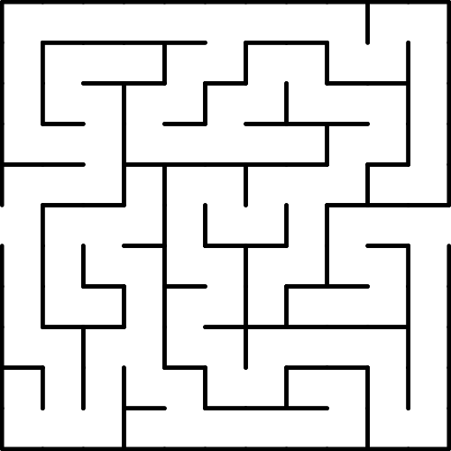
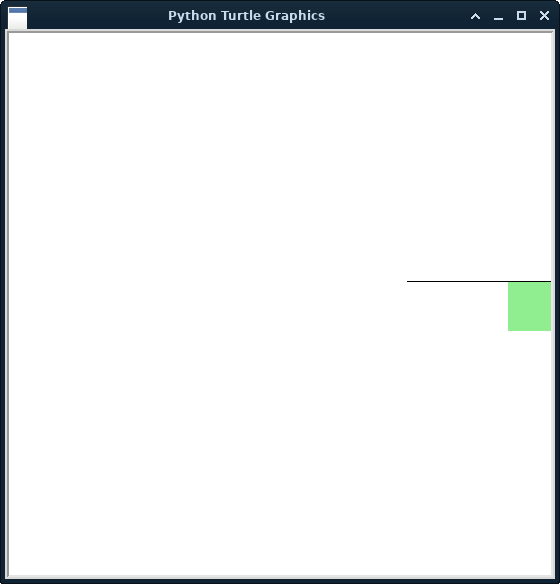
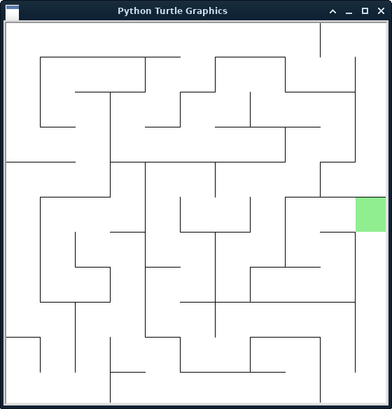

<!-- If you can't tell from the file extension, this is a markdown file. To view it as intended, open it using an app that can display markdown files.

Ex:
 - Visual Studio Code
 - Sublime Text
 - Atom
 - Typora
 - Markdown Pad

If you can't use any of these, then I recommend just reading it from the github page.-->

# How to make levels

This is a guide on how to make levels for the turtle game.  
Let's get started.

## File setup

1. Make the file for the level. It can be named whatever you want.
2. Import turtle, sleep from the time module, and everything from lvlParts
3. Make the level function with an input; this input will be for the player's turtle. The function can also be named whatever.
4. Make a global statement. We will be adding things to it as we go.
5. Make a turtle to draw walls and set it's speed to 0 to draw as fast as possible. Add this turtle to the global statement.
6. Make an empty list to store all the dots of where walls are. I recommend naming it "wallDots" for easy use with other code. Add this to the global statement as well.


Now you should have a file that looks similar to this:

```py
import turtle
from time import sleep # You can do "import time" but that means you have to type "time.sleep()" everytime you use sleep
from lvlParts import *

def draw(user): # Function that draws the map
    global walls, wallDots # Makes everything (excluding user) in the function global
    walls = turtle.Turtle() # This turtle will be drawing the walls
    walls.speed(0) # Setting the turtle speed to 0 means that the level is drawn as fast as possible
    wallDots = [] # List to store all the dots to check if a player hit a wall

```
---
## Drawing the level

Before we start drawing though, we need to know what maze we want. This maze is what I will be making in this level:



To start drawing the level we want to draw the goal then the walls.

FYI: _The size of the map is 11x11 spaces (as you can tell from the image). Each space is 50x50.  
The player moves in increments of 25 (half a space)._<br/><br/>

### Draw the goal

To draw the goal, simply add "goal(x, y, walls)". Replace "x" and "y" with the coordinates of the goal.  
The coordinates give must be the top-left corner of the space.

In this case, we will add to the draw function from before:

```py
    goal(225, 25, walls)
```

This will draw a green square on the far right side, where you see the opening.<br/><br/>

### Draw the walls

Now we have to draw the walls. Let's start with the wall next to the goal.

In the draw function we will add:
```py
    wallDots = wall(125, 25, 0, walls, 3, wallDots)
```

The reason why we are defining wallDots as the result of the function is because when drawing the walls, it also grabs the coordinates required for checking if a player hits a wall.  
As for the wall function itself, it needs 6 inputs:

1. x-coordinate
2. y-coordinate
3. heading (0 being right and 90 being up)
4. the turtle to draw the walls
5. the number of spaces the wall spans
6. the list to store all the coordinates needed for later

If we were to run it using levelTester.py it would look like this:



_If you want to test a level, make sure to change the import from 'import guideWalls' to whatever your level is named.  
You also need to make sure that the functions called are the same as your level's functions_<br/><br/>

Now all the other walls need to be drawn. I hope you enjoy writing a lot of lines! Oh, so many lines... ._.<br/><br/>

### Extras

If you've played the game, then you already know that there are things other than just walls and the goal.  
If not, here are the list of extra things that you can add to your map:
- One-way doors: As the name implies, they allow you to pass through in only one direction
- Portals: Two diamonds with the same color. Allows the player to go between two parts of the map with ease.
- Conveyors: Moves the player to a set of predifined points before ending up at their destination.
- Traps: Resets player
- Mirror mode: Has a copy of the player that does the opposite of what the player does. The copy is shown in blue while the player is red (unless modified).

All of these (excluding the portals) have a lot to do with the next function we will be making. Meanwhile, everything except mirror mode needs to be drawn.

Let me update you on the level's code so far:
<details> <!--- This is the dropdown menu. It ends at the </details> -->
<summary>Level code and map so far.</summary><br>

It currently looks like:



With the code being:

```py
import turtle
from time import sleep # You can do "import time" but that means you have to type "time.sleep()" everytime you use sleep
from lvlParts import *

def draw(user): # Function that draws the map
    global walls, wallDots # Makes everything (excluding user) in the function global
    walls = turtle.Turtle() # This turtle will be drawing the walls
    walls.speed(0) # Setting the turtle speed to 0 means that the level is drawn as fast as possible
    wallDots = [] # List to store all the dots to check if a player hit a wall

    goal(225, 25, walls)

    # Main wall tree
    wallDots = wall(125, 25, 0, walls, 3, wallDots)
    wallDots = wall(125, -75, 90, walls, 2, wallDots) # Branch heading South
    wallDots = wall(75, -75, 0, walls, 2, wallDots)
    wallDots = wall(75, -125, 90, walls, 1, wallDots)
    wallDots = wall(-25, -125, 0, walls, 5, wallDots)
    wallDots = wall(225, -225, 90, walls, 4, wallDots) # Branch on East side heading North
    wallDots = wall(175, -25, 0, walls, 1, wallDots)

    wallDots = wall(25, -175, 90, walls, 3, wallDots) # Branch in center of map heading North
    wallDots = wall(-25, -25, 0, walls, 2, wallDots)
    wallDots = wall(-25, -25, 90, walls, 1, wallDots)
    wallDots = wall(75, -25, 90, walls, 1, wallDots)

    # Return to Main wall, going down branch heading North
    wallDots = wall(175, 25, 90, walls, 1, wallDots)
    wallDots = wall(175, 75, 0, walls, 1, wallDots)
    wallDots = wall(225, 75, 90, walls, 3, wallDots)
    wallDots = wall(125, 175, 0, walls, 2, wallDots)
    wallDots = wall(125, 175, 90, walls, 1, wallDots)
    wallDots = wall(25, 225, 0, walls, 2, wallDots)
    wallDots = wall(25, 175, 90, walls, 1, wallDots)
    wallDots = wall(-25, 175, 0, walls, 1, wallDots)
    wallDots = wall(-25, 125, 90, walls, 1, wallDots)
    wallDots = wall(-75, 125, 0, walls, 1, wallDots)
    # End of Main wall

    # Start of biggest wall tree
    wallDots = wall(175, -275, 90, walls, 2, wallDots)
    wallDots = wall(75, -175, 0, walls, 2, wallDots)
    wallDots = wall(75, -225, 90, walls, 1, wallDots)
    wallDots = wall(-25, -225, 0, walls, 3, wallDots)
    wallDots = wall(-25, -225, 90, walls, 1, wallDots)
    wallDots = wall(-75, -175, 0, walls, 1, wallDots)
    wallDots = wall(-75, -175, 90, walls, 5, wallDots)
    wallDots = wall(-125, -25, 0, walls, 1, wallDots)
    wallDots = wall(-75, -75, 0, walls, 1, wallDots)

    # Split
    wallDots = wall(-125, 75, 0, walls, 5, wallDots)
    # Eastern side
    wallDots = wall(25, 25, 90, walls, 1, wallDots)
    wallDots = wall(125, 75, 90, walls, 1, wallDots)
    wallDots = wall(25, 125, 0, walls, 3, wallDots)
    wallDots = wall(75, 125, 90, walls, 1, wallDots)
    # End of Eastern side
    # Western side
    # Split
    wallDots = wall(-125, 25, 90, walls, 3, wallDots)
    # Northern side
    wallDots = wall(-175, 175, 0, walls, 2, wallDots)
    wallDots = wall(-75, 175, 90, walls, 1, wallDots)
    wallDots = wall(-225, 225, 0, walls, 4, wallDots)
    wallDots = wall(-225, 125, 90, walls, 2, wallDots)
    wallDots = wall(-225, 125, 0, walls, 1, wallDots)
    # End of Northern side
    # Southern side
    wallDots = wall(-225, 25, 0, walls, 2, wallDots)
    wallDots = wall(-225, -125, 90, walls, 3, wallDots)
    wallDots = wall(-225, -125, 0, walls, 2, wallDots)
    wallDots = wall(-125, -125, 90, walls, 1, wallDots)
    wallDots = wall(-175, -75, 0, walls, 1, wallDots)
    wallDots = wall(-175, -225, 90, walls, 2, wallDots)
    wallDots = wall(-175, -75, 90, walls, 1, wallDots)
    # End of biggest wall

    # Start of small border walls
    wallDots = wall(-275, 75, 0, walls, 2, wallDots)
    wallDots = wall(175, 225, 90, walls, 1, wallDots)
    wallDots = wall(-275, -175, 0, walls, 1, wallDots)
    wallDots = wall(-225, -225, 90, walls, 1, wallDots)
    wallDots = wall(-125, -275, 90, walls, 2, wallDots)
    wallDots = wall(-125, -225, 0, walls, 1, wallDots)
```
</details><br/>

To add one-way doors, you want to add:

```py
    oneWay(75, -125, 90, walls, "white")
```

With each of the inputs being:
1. x-coordinate
2. y-coordinate
3. heading
4. turtle to draw it
5. color for the door

